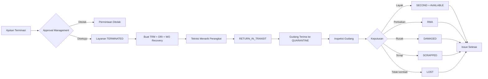
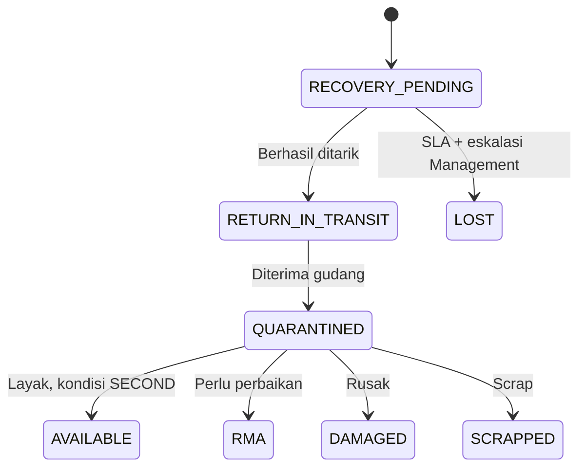

# PRD — Terminasi Pelanggan dan Recovery Perangkat

| Informasi | Nilai |
| --- | --- |
| Produk | PERUMNET CRM & Operations |
| Modul | Customer Termination & Device Recovery |
| Versi dokumen | 1.0 |
| Status | Draft untuk review tim |
| Tanggal | 11 Agustus 2026 (Asia/Makassar) |
| Product owner | Product & Operations PERUMNET |
| Pemangku kepentingan | Management, CRM/Customer Service, Teknisi, Admin Gudang, Network Operations, Engineering, QA |

## 1. Ringkasan Eksekutif

Modul ini mengatur terminasi layanan pelanggan dan penarikan perangkat milik PERUMNET secara end-to-end. Setelah terminasi disetujui, layanan pelanggan dihentikan dan sistem membuat issue penarikan serta Work Order recovery. Teknisi menarik perangkat dan mendokumentasikan kondisi awal, sedangkan Admin Gudang menerima perangkat ke area karantina dan menentukan kelayakan akhir melalui inspeksi.

Perangkat tidak boleh kembali menjadi stok tersedia sebelum diterima gudang dan dinyatakan layak. Proses harus menjaga keterlacakan pelanggan, serial/MAC, lokasi, bukti foto, tanda tangan, port jaringan, pergerakan aset, dan audit user.

## 2. Latar Belakang dan Masalah

Saat pelanggan berhenti berlangganan, perangkat PERUMNET yang terpasang perlu ditarik, diperiksa, dan dikembalikan ke inventory dengan kondisi yang benar. Tanpa proses terstruktur, perusahaan berisiko mengalami:

- Perangkat tidak tertagih atau hilang tanpa eskalasi.
- Serial/MAC tertukar antara pelanggan dan gudang.
- Perangkat rusak masuk kembali sebagai stok tersedia.
- Port ODP dilepas sebelum pemutusan fisik dikonfirmasi.
- Bukti penarikan dan inspeksi tidak lengkap.
- Perubahan stok dan status aset tidak dapat diaudit.

## 3. Tujuan Produk

1. Menyediakan satu alur baku dari pengajuan terminasi sampai keputusan akhir perangkat.
2. Memastikan hanya perangkat milik PERUMNET yang masuk proses penarikan.
3. Memisahkan penghentian layanan dari proses recovery perangkat tanpa kehilangan keterkaitan data.
4. Menjamin perangkat hasil penarikan masuk karantina sebelum tersedia untuk penggunaan ulang.
5. Menyediakan audit trail lengkap untuk setiap approval, kunjungan, bukti, inspeksi, dan pergerakan inventory.
6. Memudahkan Management memantau SLA, perangkat belum kembali, dan nilai aset yang berhasil dipulihkan.

### 3.1 Indikator Keberhasilan

- 100% terminasi yang disetujui memiliki nomor terminasi, recovery issue, dan WO recovery.
- 100% perangkat yang diterima gudang memiliki hasil inspeksi final.
- 0 perangkat berstatus karantina, RMA, rusak, atau scrap yang tersedia untuk WO baru.
- 0 pergerakan stok tersedia sebelum inspeksi menyatakan `LAYAK_DIGUNAKAN`.
- Seluruh perubahan status penting memiliki user, waktu, dan data sebelum–sesudah.
- Persentase recovery selesai dalam SLA dapat dihitung per periode, teknisi, dan wilayah.

## 4. Ruang Lingkup

### 4.1 Termasuk

- Pengajuan, approval, penolakan, dan pembatalan permintaan terminasi sebelum efektif.
- Snapshot pelanggan, layanan, alamat, jaringan, perangkat, serial, dan MAC.
- Pembuatan otomatis recovery issue dan WO bertipe `CUSTOMER_DEVICE_RECOVERY`.
- Penugasan teknisi, penjadwalan, percobaan kunjungan, dan penarikan parsial.
- Bukti foto privat, koordinat, tanda tangan pelanggan, atau alasan penolakan.
- Konfirmasi pemutusan fisik dan pelepasan port ODP.
- Penerimaan perangkat ke slot `QUARANTINE`.
- Inspeksi gudang dan keputusan layak, perbaikan, rusak, scrap, atau tidak kembali.
- Pergerakan asset, serial movement, inventory balance, stock ledger, dan slot balance.
- SLA, eskalasi, filter, timeline, audit log, dan cetak berita acara.

### 4.2 Tidak Termasuk

- Penagihan terakhir, denda perangkat hilang, invoice, pembayaran, dan refund.
- Pemutusan PPPoE langsung melalui router atau network controller.
- Proses reaktivasi pelanggan yang sudah terminated.
- Perbaikan perangkat secara detail di workshop/RMA eksternal.
- Penghapusan aset akuntansi atau proses disposal fisik di luar pencatatan keputusan.

## 5. Persona dan Tanggung Jawab

| Persona | Tanggung jawab utama |
| --- | --- |
| CRM/Customer Service | Mengajukan terminasi, memilih warehouse penerima, dan memastikan data pelanggan/perangkat benar. |
| Management | Menyetujui terminasi, memantau SLA, dan menetapkan perangkat `TIDAK_KEMBALI` setelah syarat terpenuhi. |
| Super Admin | Akses penuh, konfigurasi SLA, koreksi terkontrol, dan audit. |
| Teknisi | Menjadwalkan kunjungan, mencatat percobaan, menarik perangkat, mengunggah bukti, dan mengonfirmasi pemutusan fisik. |
| Admin Gudang | Menerima perangkat ke karantina, memeriksa serial/MAC, menjalankan inspeksi, dan menentukan hasil inventory. |
| Network Operations | Menindaklanjuti penghentian akses jaringan aktual berdasarkan status yang tercatat. |
| Auditor/QA | Memeriksa histori, bukti, konsistensi inventory, dan kepatuhan acceptance criteria. |

## 6. Istilah

| Istilah | Definisi |
| --- | --- |
| Terminasi | Penghentian layanan pelanggan setelah disetujui. |
| Recovery Issue | Dokumen operasional penarikan perangkat dari pelanggan. |
| Recovery Item | Satu perangkat/aset yang harus ditarik dan diputuskan hasil akhirnya. |
| Karantina | Lokasi sementara perangkat yang sudah diterima tetapi belum lulus inspeksi. |
| Snapshot | Salinan data pada saat transaksi agar histori tidak berubah ketika master data diperbarui. |
| COMPANY | Perangkat milik PERUMNET dan wajib diproses dalam recovery. |
| CUSTOMER | Perangkat milik pelanggan dan tidak boleh dimasukkan ke issue penarikan. |
| SLA | Batas waktu penyelesaian recovery; default 7 hari. |

## 7. Alur Utama

### 7.1 Pengajuan dan Approval Terminasi

1. Petugas membuka Customer 360 dan memilih **Ajukan Terminasi**.
2. Sistem hanya mengizinkan pelanggan berstatus layanan aktif atau suspended dan belum memiliki terminasi aktif.
3. Petugas mengisi alasan, tanggal efektif, catatan, warehouse penerima, dan memilih perangkat ber-ownership `COMPANY`.
4. Management atau Super Admin menyetujui atau menolak permintaan.
5. Saat disetujui, satu transaksi atomik harus:
   - Membuat nomor `TRM-YYYYMMDD-XXXX`.
   - Mengubah layanan menjadi `TERMINATED`.
   - Membuat recovery issue `DRI-YYYYMMDD-XXXX`.
   - Membuat Work Order bertipe `CUSTOMER_DEVICE_RECOVERY`.
   - Mengubah status aset terpilih menjadi `RECOVERY_PENDING`.
   - Menyimpan snapshot pelanggan, layanan, jaringan, perangkat, serial, MAC, dan alamat.

### 7.2 Penarikan oleh Teknisi

1. Teknisi melihat tugas pada Portal Teknisi dan menjadwalkan kunjungan.
2. Setiap percobaan mencatat waktu, hasil, catatan, koordinat, dan bukti bila tersedia.
3. Untuk perangkat yang berhasil ditarik, teknisi mencatat serial/MAC aktual, aksesori, kondisi fisik awal, foto, koordinat, dan tanda tangan pelanggan.
4. Bila pelanggan menolak tanda tangan, alasan penolakan wajib diisi.
5. Perangkat yang berhasil ditarik menjadi `RETURN_IN_TRANSIT`.
6. Penarikan dapat parsial; item lain tetap terbuka dan dapat dijadwalkan kembali.

### 7.3 Pemutusan Fisik dan Jaringan

- Port ODP tidak boleh dilepas saat terminasi hanya disetujui secara administratif.
- Teknisi harus mengonfirmasi pemutusan fisik.
- Setelah konfirmasi, sistem melepaskan relasi pelanggan dari port dan mengubah port menjadi `AVAILABLE`.
- PPPoE, VLAN, server, dan data jaringan lama tetap disimpan sebagai snapshot histori sebelum assignment aktif dikosongkan.
- Penghentian akses pada perangkat jaringan tetap dilakukan oleh tim operasional di luar aplikasi dan dicatat status/auditnya.

### 7.4 Penerimaan dan Inspeksi Gudang

1. Admin Gudang memindai atau mencari nomor recovery/serial.
2. Sistem memvalidasi warehouse penerima dan kecocokan serial/MAC.
3. Perangkat diterima ke slot `QUARANTINE`, berstatus `QUARANTINED`, tanpa menambah stok tersedia.
4. Admin Gudang menjalankan checklist inspeksi:
   - Casing, konektor, tombol, dan adaptor.
   - Power-on dan proses booting.
   - Factory reset dan penghapusan konfigurasi pelanggan.
   - Tes LAN, Wi-Fi, dan port.
   - Tes optical/LOS untuk ONT.
   - Kelengkapan aksesori.
   - Foto hasil pemeriksaan.
5. Admin memilih satu keputusan final untuk setiap item.

### 7.5 Keputusan Akhir

| Keputusan | Kondisi/Status | Dampak inventory |
| --- | --- | --- |
| `LAYAK_DIGUNAKAN` | `SECOND` + `AVAILABLE` | Menambah stok tersedia dan masuk slot Second/Operational. |
| `PERLU_PERBAIKAN` | `RMA` | Masuk slot RMA dan tidak tersedia untuk WO. |
| `RUSAK` | `DAMAGED` | Masuk saldo/slot rusak dan tidak tersedia untuk WO. |
| `SCRAP` | `SCRAPPED` | Tidak menambah saldo inventory tersedia. |
| `TIDAK_KEMBALI` | `LOST` | Tidak menambah stok; hanya Management setelah SLA dan minimal percobaan terpenuhi. |

Recovery issue selesai hanya jika seluruh item memiliki keputusan final.

## 8. Status dan Transisi

### 8.1 Terminasi

`DRAFT → SUBMITTED → APPROVED → EFFECTIVE`

Cabang yang diperbolehkan:

- `SUBMITTED → REJECTED`
- `DRAFT/SUBMITTED → CANCELLED`
- Terminasi yang sudah `EFFECTIVE` tidak dapat dibatalkan langsung.

### 8.2 Recovery Issue

`OPEN → ASSIGNED → IN_PROGRESS → PARTIAL/RECOVERED → INSPECTION → COMPLETED`

Status eskalasi dapat berjalan bersama status operasional ketika melewati SLA.

### 8.3 Recovery Item dan Asset

## 9. Kebutuhan Fungsional

### 9.1 Terminasi Pelanggan

| ID | Kebutuhan |
| --- | --- |
| FR-TERM-001 | Sistem menyediakan aksi Ajukan Terminasi pada Customer 360 untuk user berizin. |
| FR-TERM-002 | Sistem mencegah terminasi ganda untuk pelanggan yang sama. |
| FR-TERM-003 | Email, pelanggan, alasan, tanggal efektif, warehouse penerima, dan minimal satu perangkat perusahaan harus tervalidasi sebelum submit. |
| FR-TERM-004 | Perangkat ber-ownership `CUSTOMER` tidak boleh dipilih. |
| FR-TERM-005 | Approval membuat terminasi, issue, WO, snapshot, dan perubahan aset secara atomik. |
| FR-TERM-006 | Penolakan menyimpan alasan, approver, dan waktu. |
| FR-TERM-007 | Timeline terminasi tampil pada Customer 360. |

### 9.2 Penugasan dan Penarikan

| ID | Kebutuhan |
| --- | --- |
| FR-PICK-001 | Admin dapat menugaskan teknisi dan jadwal recovery. |
| FR-PICK-002 | Teknisi hanya melihat recovery yang ditugaskan kepadanya, kecuali memiliki akses semua tugas. |
| FR-PICK-003 | Teknisi dapat mencatat beberapa percobaan kunjungan. |
| FR-PICK-004 | Sistem mendukung penarikan lengkap maupun parsial. |
| FR-PICK-005 | Serial/MAC aktual harus dibandingkan dengan snapshot dan mismatch wajib diberi catatan. |
| FR-PICK-006 | Bukti foto, kondisi awal, aksesori, koordinat, serta tanda tangan/alasan penolakan disimpan privat. |
| FR-PICK-007 | Konfirmasi pemutusan fisik menjadi syarat pelepasan port ODP. |

### 9.3 Penerimaan Gudang

| ID | Kebutuhan |
| --- | --- |
| FR-RECV-001 | Admin Gudang dapat menerima item berdasarkan issue, serial, atau MAC. |
| FR-RECV-002 | Penerimaan hanya diizinkan untuk item `RETURN_IN_TRANSIT`. |
| FR-RECV-003 | Penerimaan memindahkan item ke slot `QUARANTINE` dan tidak menambah stok tersedia. |
| FR-RECV-004 | Serial tidak cocok membutuhkan resolusi/catatan dan audit, bukan koreksi diam-diam. |
| FR-RECV-005 | Penerimaan parsial mempertahankan issue tetap terbuka. |

### 9.4 Inspeksi

| ID | Kebutuhan |
| --- | --- |
| FR-INSP-001 | Checklist inspeksi wajib diselesaikan sesuai jenis perangkat. |
| FR-INSP-002 | Keputusan final memerlukan inspector, waktu, catatan, dan minimal satu foto hasil pemeriksaan. |
| FR-INSP-003 | `LAYAK_DIGUNAKAN` menghasilkan kondisi `SECOND`, bukan `NEW`. |
| FR-INSP-004 | `RMA`, `DAMAGED`, `SCRAPPED`, dan `LOST` tidak dapat dialokasikan ke WO baru. |
| FR-INSP-005 | `TIDAK_KEMBALI` hanya dapat dipilih Management setelah SLA dan minimal tiga percobaan. |
| FR-INSP-006 | Issue otomatis selesai setelah seluruh item final. |

### 9.5 Inventory dan Audit

| ID | Kebutuhan |
| --- | --- |
| FR-INV-001 | Asset, slot balance, inventory balance, stock ledger, dan serial movement diperbarui dalam transaksi atomik. |
| FR-INV-002 | Sistem mencegah serial diproses oleh dua recovery aktif. |
| FR-INV-003 | Sistem mencegah saldo negatif dan double counting. |
| FR-INV-004 | Slot `QUARANTINE`, `SECOND`, `RMA`, dan `DAMAGED` tersedia pada setiap warehouse fisik. |
| FR-AUD-001 | Approval, status, attempt, pickup, pemutusan port, receipt, inspection, dan stock movement dicatat pada audit log. |
| FR-AUD-002 | Audit menyimpan user, waktu, entity, action, serta nilai sebelum–sesudah. |

### 9.6 Pencarian, Filter, dan Dokumen

| ID | Kebutuhan |
| --- | --- |
| FR-UI-001 | Daftar terminasi dan recovery dapat dicari dengan nomor, pelanggan, serial, atau MAC. |
| FR-UI-002 | Filter mencakup teknisi, warehouse, status, hasil inspeksi, dan jatuh tempo SLA. |
| FR-UI-003 | Detail menampilkan timeline lengkap dan tautan silang ke Customer, WO, asset, dan warehouse. |
| FR-UI-004 | Berita acara penarikan dan inspeksi dapat dicetak A4 tanpa sidebar. |
| FR-UI-005 | Tampilan utama responsif dan tidak menimbulkan horizontal overflow pada mobile. |

## 10. Halaman dan Navigasi

| Area | Route | Fungsi |
| --- | --- | --- |
| Customer 360 | `/customers/[id]` | Ajukan terminasi dan melihat timeline/perangkat. |
| CRM | `/terminations` | Daftar, filter, dan approval terminasi. |
| CRM | `/terminations/[number]` | Detail terminasi dan status recovery terkait. |
| Warehouse | `/device-recoveries` | Antrean penerimaan, inspeksi, SLA, dan hasil. |
| Warehouse | `/device-recoveries/[number]` | Detail issue, item, receipt, inspeksi, dan timeline. |
| Warehouse | `/device-recoveries/[number]/print` | Cetak berita acara A4. |
| Teknisi | `/portal/recoveries` | Daftar tugas recovery teknisi. |
| Teknisi | `/portal/recoveries/[number]` | Jadwal, attempt, pickup, bukti, dan pemutusan fisik. |

## 11. Model Data Tingkat Tinggi

| Entitas | Tujuan |
| --- | --- |
| `CustomerTermination` | Permintaan, approval, alasan, tanggal efektif, snapshot layanan, dan warehouse tujuan. |
| `DeviceRecoveryIssue` | Dokumen operasional recovery yang terkait tepat satu terminasi dan satu WO recovery. |
| `DeviceRecoveryItem` | Snapshot dan lifecycle setiap perangkat yang harus ditarik. |
| `DeviceRecoveryAttempt` | Riwayat kunjungan/percobaan penarikan. |
| `DeviceInspection` | Checklist, hasil uji, keputusan, inspector, dan waktu inspeksi. |
| `DeviceRecoverySetting` | SLA hari dan minimal attempt untuk eskalasi/lost. |
| `Asset` | Ownership, condition, dan status lifecycle perangkat. |
| `DocumentAttachment` | Foto/bukti privat untuk attempt, pickup, dan inspection. |
| `DocumentSignature` | Tanda tangan pelanggan/teknisi sesuai dokumen terkait. |

### 11.1 Nomor Dokumen

- Terminasi: `TRM-YYYYMMDD-XXXX`
- Recovery issue: `DRI-YYYYMMDD-XXXX`
- Work Order: mengikuti sequence WO yang berlaku.
- Nomor harus unik dan aman terhadap request bersamaan.

### 11.2 Aturan Snapshot

Saat approval, simpan sekurang-kurangnya:

- Nama dan kode pelanggan.
- Kontak dan alamat pekerjaan.
- Paket/status layanan.
- Koordinat lokasi.
- ODP, port, PPPoE, VLAN, dan server yang terkait.
- Item, kategori, serial, MAC, ownership, dan kondisi perangkat.
- Warehouse penerima dan SLA yang berlaku.

## 12. Hak Akses

| Permission | Penggunaan |
| --- | --- |
| `termination.create` | Mengajukan terminasi. |
| `termination.view` | Melihat daftar/detail terminasi. |
| `termination.approve` | Menyetujui atau menolak terminasi. |
| `termination.cancel` | Membatalkan permintaan sebelum efektif. |
| `device_recovery.assign` | Menugaskan teknisi dan jadwal. |
| `device_recovery.pickup` | Mencatat attempt dan penarikan. |
| `device_recovery.receive` | Menerima perangkat ke karantina. |
| `device_recovery.inspect` | Menjalankan inspeksi dan keputusan gudang. |
| `device_recovery.dispose` | Menetapkan scrap sesuai kewenangan. |
| `device_recovery.escalate` | Eskalasi dan keputusan tidak kembali. |

Semua endpoint wajib melakukan pengecekan permission di server; menyembunyikan tombol di UI saja tidak cukup.

## 13. Aturan Bisnis dan Invariant

1. Hanya aset ber-ownership `COMPANY` yang dapat masuk recovery issue.
2. Satu aset tidak boleh berada pada lebih dari satu recovery aktif.
3. Terminasi efektif langsung menghentikan status layanan, tetapi tidak otomatis menyatakan perangkat kembali.
4. Port ODP hanya dilepas setelah konfirmasi pemutusan fisik.
5. Perangkat yang baru ditarik berstatus transit, bukan available.
6. Penerimaan gudang selalu masuk karantina.
7. Hanya hasil `LAYAK_DIGUNAKAN` yang menambah stok tersedia.
8. Hasil layak selalu menggunakan kondisi `SECOND`.
9. `RMA`, `DAMAGED`, `SCRAPPED`, dan `LOST` tidak tersedia untuk reservasi atau WO.
10. `TIDAK_KEMBALI` memerlukan SLA terlewati, minimal tiga attempt, dan keputusan Management.
11. Terminasi efektif tidak dibatalkan; pelanggan harus melalui proses reaktivasi terpisah.
12. Semua perubahan stok, asset, slot, ledger, dan serial dilakukan secara atomik.

## 14. Notifikasi dan Eskalasi

- Notifikasi ke approver saat permintaan diajukan.
- Notifikasi ke teknisi saat ditugaskan atau jadwal berubah.
- Peringatan H-1 dan saat recovery melewati SLA.
- Notifikasi ke Admin Gudang ketika item berstatus transit menuju warehouse.
- Notifikasi ke Management ketika syarat eskalasi perangkat tidak kembali terpenuhi.
- Notifikasi tidak boleh mengekspos foto, tanda tangan, atau data sensitif melalui URL publik.

## 15. Keamanan dan Privasi

- Foto, tanda tangan, dan bukti disimpan pada storage privat melalui endpoint terautentikasi.
- File divalidasi berdasarkan MIME, ukuran, dan extension yang diizinkan.
- Path traversal harus ditolak dan respons file menggunakan header keamanan yang sesuai.
- Koordinat pelanggan tidak dikirim ke geocoder publik.
- PII ditampilkan sesuai permission dan dimasking pada daftar bila diperlukan.
- Audit log tidak boleh menyimpan kredensial PPPoE atau password pelanggan dalam bentuk terbaca.

## 16. Kebutuhan Nonfungsional

| Area | Kebutuhan |
| --- | --- |
| Konsistensi | Transaksi inventory kritis memakai isolasi yang mencegah double update dan serial ganda. |
| Performa | Daftar terpaginasikan dan memiliki indeks untuk nomor, status, due date, customer, warehouse, technician, serial, dan MAC. |
| Reliability | Request berulang/idempotent tidak boleh menghasilkan dokumen atau ledger ganda. |
| Waktu | Semua tanggal operasional ditampilkan dalam zona `Asia/Makassar`. |
| Mobile | Portal teknisi dapat digunakan pada layar ponsel dan kondisi jaringan terbatas. |
| Accessibility | Form memiliki label, fokus keyboard, pesan error yang jelas, dan kontras yang memadai. |
| Observability | Error transaksi, upload, dan mismatch inventory dicatat tanpa membocorkan data sensitif. |
| Compatibility | Data Customer, Installation, Asset, Inventory, WO, Return, dan Stock Card lama tetap dapat dibaca. |

## 17. Laporan dan KPI Operasional

- Jumlah terminasi diajukan, disetujui, ditolak, dan efektif per periode.
- Recovery open, overdue, partial, inspection, dan completed.
- Persentase recovery selesai dalam SLA.
- Jumlah dan nilai perangkat `SECOND`, `RMA`, `DAMAGED`, `SCRAPPED`, dan `LOST`.
- Rata-rata waktu approval, pickup, transit, receipt, dan inspection.
- Recovery rate per teknisi, wilayah, jenis perangkat, dan warehouse.
- Daftar serial/MAC dengan mismatch atau lebih dari satu attempt.

## 18. Acceptance Criteria

| ID | Skenario | Hasil yang diharapkan |
| --- | --- | --- |
| AC-001 | Terminasi pelanggan aktif disetujui | Layanan terminated dan TRM, DRI, WO, item, snapshot, serta audit terbentuk atomik. |
| AC-002 | Terminasi pelanggan suspended disetujui | Alur berhasil dengan aturan yang sama seperti pelanggan aktif. |
| AC-003 | Terminasi kedua diajukan | Sistem menolak karena sudah ada terminasi aktif/efektif. |
| AC-004 | Perangkat milik pelanggan dipilih | Sistem menolak item tersebut. |
| AC-005 | Pickup parsial | Item terambil menjadi transit; item lain tetap open. |
| AC-006 | Serial/MAC aktual tidak cocok | Penyelesaian ditahan atau memerlukan resolusi dan audit eksplisit. |
| AC-007 | Pemutusan fisik belum dikonfirmasi | Port ODP tetap terikat dan tidak menjadi available. |
| AC-008 | Perangkat diterima gudang | Status menjadi quarantined; stok tersedia tidak bertambah. |
| AC-009 | Inspeksi layak | Aset menjadi SECOND + AVAILABLE dan seluruh ledger/balance konsisten. |
| AC-010 | Inspeksi perlu perbaikan | Aset masuk RMA dan tidak dapat dipilih untuk WO. |
| AC-011 | Inspeksi rusak/scrap | Aset masuk status/slot sesuai keputusan dan tidak tersedia untuk WO. |
| AC-012 | Lost sebelum SLA/minimal attempt | Sistem menolak keputusan. |
| AC-013 | Lost oleh Management setelah syarat terpenuhi | Item final sebagai LOST dan audit lengkap tersimpan. |
| AC-014 | Dua user memproses serial bersamaan | Hanya satu transaksi berhasil; tidak ada ledger atau saldo ganda. |
| AC-015 | Semua item telah final | Recovery issue otomatis menjadi completed. |
| AC-016 | Role tanpa permission membuka route/action | Server mengembalikan akses ditolak. |
| AC-017 | Foto privat dibuka tanpa login | File tidak dapat diakses. |
| AC-018 | Tampilan mobile teknisi | Form pickup, kamera, koordinat, dan tanda tangan dapat digunakan tanpa overflow. |

## 19. Rencana Pengujian

### 19.1 Functional Test

- Approval, rejection, cancellation, duplicate termination, dan effective date.
- Penarikan lengkap, parsial, gagal, ditolak pelanggan, serta beberapa attempt.
- Serial cocok, serial mismatch, MAC mismatch, dan aksesori tidak lengkap.
- Receipt penuh/parsial dan warehouse tujuan yang salah.
- Seluruh hasil inspeksi dan penyelesaian otomatis issue.
- Filter, pencarian, pagination, timeline, dan print A4.

### 19.2 Integrity dan Concurrency Test

- Penomoran TRM/DRI bersamaan.
- Dua pickup pada item yang sama.
- Dua receipt/inspection pada serial yang sama.
- Rekonsiliasi Asset, InventoryBalance, StockLedger, SlotBalance, dan SerialMovement.
- Simulasi kegagalan di tengah transaksi untuk memastikan rollback penuh.

### 19.3 Security Test

- Matrix role/permission untuk seluruh halaman dan action.
- Akses foto/tanda tangan tanpa login atau dari teknisi yang tidak ditugaskan.
- File MIME palsu, file terlalu besar, dan path traversal.
- PII masking dan audit yang tidak menyimpan credential sensitif.

### 19.4 Regression Test

- Customer 360 dan CRM Dashboard.
- Installation Portal dan Portal Teknisi.
- Inventory, Stock Card, Return, Work Order, Branch Stock, dan Stock Transfer.
- Gallery dan protected attachments.

## 20. Rollout dan Migrasi

1. Terapkan migrasi Prisma additive; jangan menghapus data lama.
2. Backfill aset inventory lama sebagai ownership `COMPANY` jika ownership belum terisi.
3. Seed permission, menu, sequence, setting SLA, dan slot warehouse secara idempotent.
4. Jalankan `prisma validate`, `prisma generate`, TypeScript, dan production build.
5. Jalankan migration deploy dan seed pada database PostgreSQL aktif.
6. Lakukan smoke test dengan satu pelanggan demo tanpa mengubah saldo produksi.
7. Uji role CRM, Management, Teknisi, dan Admin Gudang.
8. UAT menggunakan skenario lengkap, parsial, rusak, RMA, dan tidak kembali.
9. Pantau audit dan rekonsiliasi inventory pada periode awal penggunaan.

### 20.1 Status Implementasi Saat Dokumen Dibuat

- Struktur schema, migrasi additive, seed, helper server, UI terminasi/recovery, permission, dan alur inti telah tersedia pada source lokal.
- Validasi Prisma, generate client, TypeScript, dan production build telah berhasil dijalankan.
- Penerapan migration/seed ke database lokal dan UAT browser masih perlu dijalankan ketika PostgreSQL `localhost:5432` aktif.

## 21. Risiko dan Mitigasi

| Risiko | Dampak | Mitigasi |
| --- | --- | --- |
| Data ownership aset lama tidak akurat | Perangkat pelanggan dapat ikut ditarik | Backfill konservatif, review data, dan koreksi ter-audit sebelum approval. |
| Serial/MAC di lapangan berbeda | Salah identifikasi aset | Wajib foto label, catatan mismatch, dan resolusi gudang. |
| Teknisi offline | Bukti tidak langsung tersimpan | Form mobile ringkas, validasi draft, dan retry upload terkontrol. |
| Stok bertambah terlalu dini | Inventory tersedia tidak valid | Selalu quarantine; update available hanya pada inspeksi layak. |
| Port ODP dilepas terlalu cepat | Gangguan dokumentasi jaringan | Pisahkan approval terminasi dari konfirmasi pemutusan fisik. |
| Perangkat tidak kembali | Kehilangan aset | SLA, minimal attempt, alert, eskalasi Management, dan KPI lost. |
| File bukti terekspos | Pelanggaran privasi | Private storage, endpoint terautentikasi, dan no-store. |

## 22. Pertanyaan Terbuka untuk Tim

| ID | Pertanyaan | Pemilik keputusan | Status |
| --- | --- | --- | --- |
| Q-001 | Apakah nilai buku perangkat perlu ditampilkan pada proses eskalasi lost? | Finance/Management | Terbuka |
| Q-002 | Siapa yang berhak menyetujui scrap selain Super Admin? | Management | Terbuka |
| Q-003 | Apakah SLA berbeda per wilayah atau jenis perangkat? | Operations | Terbuka |
| Q-004 | Apakah pelanggan menerima salinan berita acara melalui email/WhatsApp? | CRM/Legal | Terbuka |
| Q-005 | Apakah adapter/kabel dicatat sebagai aset serial atau aksesori kuantitas? | Warehouse | Terbuka |
| Q-006 | Kapan integrasi pemutusan PPPoE otomatis dijadwalkan? | Network/Engineering | Di luar scope saat ini |

## 23. Pembagian Kolaborasi Tim

| Tim | Output yang diharapkan |
| --- | --- |
| Product & Operations | Finalisasi aturan bisnis, SLA, status, dan acceptance criteria. |
| CRM/Customer Service | Review form pengajuan, alasan terminasi, komunikasi pelanggan, dan data wajib. |
| Teknisi | Review alur mobile, bukti, attempt, aksesori, koordinat, dan tanda tangan. |
| Warehouse | Finalisasi checklist inspeksi, slot, keputusan, dan rekonsiliasi stok. |
| Network Operations | Validasi proses pemutusan fisik, ODP, PPPoE, VLAN, dan snapshot jaringan. |
| Engineering | Schema, transaksi atomik, permission, private storage, UI, dan observability. |
| QA | Test case, concurrency, security, regression, dan UAT evidence. |

### 23.1 Cara Menggunakan Dokumen Ini

1. Buat branch atau pull request khusus perubahan PRD.
2. Gunakan ID requirement dan acceptance criteria pada issue, commit, serta test case.
3. Catat keputusan baru pada tabel Decision Log di bawah.
4. Perbarui versi dan changelog setiap scope/aturan bisnis disetujui.
5. Jangan mengubah status menjadi **Approved** sebelum Product, Operations, Warehouse, Network, Engineering, dan QA menyetujui bagian terkait.

## 24. Decision Log

| Tanggal | Keputusan | Alasan | Disetujui oleh |
| --- | --- | --- | --- |
| 11-08-2026 | Terminasi layanan efektif segera setelah approval | Recovery perangkat berjalan terpisah dan tidak menunda penghentian layanan. | Draft |
| 11-08-2026 | Semua perangkat kembali masuk karantina | Mencegah perangkat belum teruji masuk stok tersedia. | Draft |
| 11-08-2026 | Hasil layak menggunakan kondisi SECOND | Perangkat telah digunakan pelanggan sebelumnya. | Draft |
| 11-08-2026 | Lost memerlukan SLA dan minimal tiga attempt | Menjaga akuntabilitas sebelum aset dinyatakan tidak kembali. | Draft |

## 25. Definition of Done

Fitur dinyatakan selesai jika:

- Seluruh acceptance criteria prioritas utama lulus.
- Migrasi dan seed dapat dijalankan berulang tanpa merusak data.
- Prisma validation/generate, TypeScript, dan production build berhasil.
- Hak akses setiap role sudah diuji di server dan UI.
- Semua state transition serta transaksi inventory memiliki audit trail.
- Foto/tanda tangan tidak dapat diakses publik.
- Rekonsiliasi asset, serial, slot, ledger, dan balance konsisten.
- UAT ditandatangani Product, CRM, Teknisi, Warehouse, Network Operations, dan QA.
- Runbook deployment dan rollback tersedia untuk environment tujuan.

## 26. Changelog

| Versi | Tanggal | Perubahan |
| --- | --- | --- |
| 1.0 | 11-08-2026 | Dokumen awal untuk terminasi pelanggan dan recovery perangkat. |
